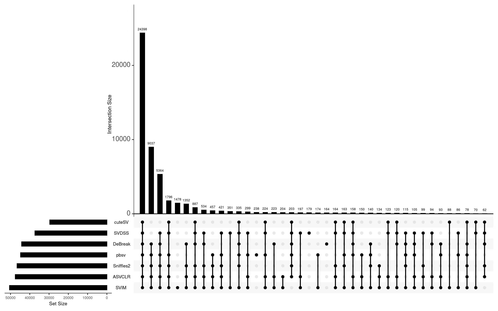

# ASVBM experiment
In our experiments, we used the high accuracy of the PacBio sequencing platform in CCS mode, combined with minimap2's alignment capability for long-read data and 30X the coverage depth. This approach provides a well-balanced strategy for detecting variants. The identification results of HG002 CCS data were benchmarked using ASVCLR(v1.4.4), SVDSS (v2.0.0), Debreak (v2.0.3), Sniffles2 (v2.0.2), pbsv (v2.9.0), cuteSV (v2.0.3), and SVIM(v2.0.0), respectively. The benchmark dataset was the high-confidence HG002 dataset created by the Genome in a Bottle Consortium (GIAB). More specific experimental information was shown as follows.
## Prerequisites

### Tools

We used  [ASVBM](https://github.com/zhuxiao/asvbm) to benchmark variant calling results.

```sh
$ wget -c https://github.com/zhuxiao/asvbm/releases/download/1.3.0/asvbm_1.3.0.tar.xz
$ tar -xf asvbm_1.3.0.tar.xz
$ cd asvbm_1.3.0/
$ ./autogen.sh
$ sudo apt install -y r-base r-base-dev
# Install the UpSetR package
$ R
$ install.packages("UpSetR")
```

And the binary file `ASVBM` will be output into the folder `bin` in this package directory.

We used the following detection methods for variant calling. In addition to the SV detection method included in this experiment, we also introduced a new SV detection tool ASVCLR, and benchmarked its SV identification results.

```sh
# Get ASVCLR 
$ wget -c https://github.com/zhuxiao/asvclr/releases/download/1.4.4/asvclr_1.4.4.tar.xz
$ tar -xf asvclr_1.4.4.tar.xz
$ cd asvclr_1.4.4/
$ ./auto_gen.sh
# Or get from github
$ git clone https://github.com/zhuxiao/asvclr.git
$ tar -xf asvclr_1.4.4.tar.xz
$ cd asvclr_1.4.4/
$ ./auto_gen.sh
```

And the binary file `asvclr` will be output into the folder `bin` in this package directory.

```sh
# Get SVDSS v2.0.0-alpha.1
$ wget -c https://github.com/Parsoa/SVDSS/archive/refs/tags/v2.0.0-alpha.1.tar.gz
$ tar -zxvf SVDSS-2.0.0-alpha.1.tar.gz
$ cd SVDSS
$ mkdir build ; cd build
$ cmake -DCMAKE_BUILD_TYPE=Release ..
$ make
# Get DeBreak cuteSV pbsv sniffles svim and samtools
$ conda install debreak=2.0.3 cuteSV=2.0.3 pbsv=2.9.0 sniffles2=2.0.2 svim=2.0.0 samtools  
# We need ngmlr v0.2.7 to align fasta or fastq with reference
$ wget https://github.com/philres/ngmlr/releases/download/v0.2.7/ngmlr-0.2.7-linux-x86_64.tar.gz
$ tar xvzf ngmlr-0.2.7-linux-x86_64.tar.gz
$ cd ngmlr-0.2.7/
$ mkdir build ; cd build
$ cmake ..
$ make
# Get minimap2 v2.26
$ git clone https://github.com/lh3/minimap2
$ cd minimap2 && make
# We also need sratoolkit to download PacBio CCS data.
# centOS
$ wget -c https://ftp-trace.ncbi.nlm.nih.gov/sra/sdk/3.0.10/sratoolkit.3.0.10-centos_linux64.tar.gz
$ tar -zxvf sratoolkit.3.0.10-centos_linux64.tar.gz
$ cd sratoolkit.3.0.10-centos/bin/
$ ln -s prefetch /usr/local/bin/prefetch
$ ln -s fastq-dump /usr/local/bin/fastq-dump
$ ln -s fasterq-dump /usr/local/bin/fasterq-dump
# ubuntu
$ wget -c https://ftp-trace.ncbi.nlm.nih.gov/sra/sdk/3.0.10/sratoolkit.3.0.10-ubuntu64.tar.gz
$ tar -zxvf sratoolkit.3.0.10-ubuntu64.tar.gz
$ cd sratoolkit.3.0.10-ubuntu64
$ ln -s prefetch /usr/local/bin/prefetch
$ ln -s fastq-dump /usr/local/bin/fastq-dump
$ ln -s fasterq-dump /usr/local/bin/fasterq-dump
```

And the binary files `prefetch`、 `fastq-dump`  and `fasterq-dump` will be output into the folder `bin` in this package directory.

### Data

In our experimental benchmarking, we used hg19.

#### Download reference

```sh
# Reference
$ wget ftp://ftp-trace.ncbi.nih.gov/1000genomes/ftp/technical/reference/phase2_reference_assembly_sequence/hs37d5.fa.gz
$ gunzip hs37d5.fa.gz
# Extract chromosomes from 1 to 22 and X and Y
$ samtools faidx hs37d5.fa 1 2 3 4 5 6 7 8 9 10 11 12 13 14 15 16 17 18 19 20 21 22 X Y > hs37d5.chroms.fa
```

## HG002

Download [HG002 PacBio CCS](https://www.ncbi.nlm.nih.gov/sra/SRX5327410) data.  After aligning with minimap2, convert them into bam files using samtools, sort and create index. For convenience, we provide a shell script and a list of accessions to help you obtain the fastq file (see the `script` folder). Significantly, you need to ensure that the file and the script are in the same folder.

```sh
$ ./prefetch_fastq.sh SRR_Acc_List.txt SRR885_whole.fastq
$ minimap2 -t 32 -x map-hifi -a -Y -o HG002_pacbio_ccs.sam -r hs37d5.chroms.fa -q SRR885_whole.fastq
$ samtools view -bSh -@ 12 HG002_pacbio_ccs.sam > HG002_pacbio_ccs.bam
$ samtools sort -@ 12 -o HG002_pacbio_ccs_sorted.bam HG002_pacbio_ccs.bam
$ samtools index -@ 12 HG002_pacbio_ccs_sorted.bam HG002_pacbio_ccs_sorted.bai
# remove fastq to save storage space
$ rm -rf HG002_pacbio_ccs.sam HG002_pacbio_ccs.bam
```

## Variant calling

```sh
# ASVCLR
$ asvclr all -m 20 -p hg002_hs37d5_asvclr -o output_debug_hs37d5_q0_20240408 hs37d5.fa HG002_pacbio_ccs_sorted.bam
$ mv hg002_hs37d5_asvclr_variants.vcf output_ASVCLR.vcf
```

More  detailed usage of ASVCLR can be obtained from Github ([ASVCLR](https://github.com/zhuxiao/asvclr)).

You can get variant detection results in folder `4_results` and variant detection results are reported in VCF file format in this file folder: `genome_variants.vcf`.

```sh
#SVDSS
$ SVDSS index --threads 12 --reference hs37d5.fa --index hs37d5.fmd
$ SVDSS smooth --threads 12 --reference hs37d5.fa --bam HG002_pacbio_ccs_sorted.bam > HG002_hs37d5_pacbio_ccs_ash_sorted_smoothed.bam
$ samtools index HG002_hs37d5_pacbio_ccs_ash_sorted_smoothed.bam
$ SVDSS search --threads 12 --index hs37d5.fmd --bam HG002_hs37d5_pacbio_ccs_ash_sorted_smoothed.bam > specifics.txt
$ SVDSS call --threads 12 --reference hs37d5.fa --bam HG002_hs37d5_pacbio_ccs_ash_sorted_smoothed.bam --sfs specifics.txt > output_SVDSS.vcf
# DeBreak
$ debreak --thread 12 --min_size 20 --bam HG002_hs37d5_pacbio_ccs_ash_sorted_smoothed.bam --outpath output_debreak_hs37d5 --rescue_large_ins --poa --ref hs37d5.fa 
$ cd output_debreak_hs37d5 && mv debreak.vcf output_DebBeak.vcf
# cuteSV
$ cuteSV -t 12 -l 20 --genotype HG002_pacbio_ccs_sorted.bam hs37d5.chroms.fa output_cuteSV.vcf $PWD
# pbsv
$ pbsv discover -s HG002_30X_CCS HG002_pacbio_ccs_sorted.bam ref.out.svsig.gz
$ pbsv call -m 20 --ccs hs37d5.chroms.fa ref.out.svsig.gz output_pbsv.vcf
# Sniffles2
$ sniffles --minsvlen 20 -i HG002_pacbio_ccs_sorted.bam -v output_Sniffles.vcf
# svim
$ svim alignment --min_sv_size 20 --sample HG002_CCS_30X HG002_pacbio_ccs_sorted.bam hs37d5.chroms.fa
$ mv variants.vcf output_SVIM.vcf
```

You can get the following seven results. Identification results are saved within the `Identification_result` directory:

* **ASVCLR** : `output_ASVCLR.vcf`
* **SVDSS** : `output_SVDSS.vcf`
* **DeBreak** : `output_DeBreak.vcf`
* **cuteSV** : `output_cuteSV.vcf`
* **pbsv** : `output_pbsv.vcf`
* **Sniffles2** : `output_sniffles2.vcf`
* **SVIM** : `output_SVIM.vcf`

## GIAB analysis

In this experiment, we used HG002_SVs_Tier1_v0.6.vcf as the gold benchmark set required for the benchmarking of user-called sets, which can be downloaded as follows:

```sh
# Get GIAB VCF Tier 1 
$ wget https://ftp-trace.ncbi.nlm.nih.gov/giab/ftp/data/AshkenazimTrio/analysis/NIST_SVs_Integration_v0.6/HG002_SVs_Tier1_v0.6.vcf.gz
$ gunzip HG002_SVs_Tier1_v0.6.vcf.gz

# Run ASVBM against the Tier1 callset and ASVBM can benchmark multiple user-called sets simultaneously.
$ asvbm stat -m 50000 -i 0.7 -p 0.7 -T "ASVCLR;SVDSS;DeBreak;Sniffles2;pbsv;cuteSV;SVIM" -C "1;2;3;4;5;6;7;8;9;10;11;12;13;14;15;16;17;18;19;20;21;22;X;Y" output_ASVCLR.vcf output_SVDSS.vcf output_DeBreak.vcf output_sniffles2.vcf output_pbsv.vcf output_cuteSV.vcf output_SVIM.vcf hs37d5.chroms.fa -o Tier1_eval
```

We used `-T` option to specify the name of the detection method and the `-C` option to specify the set of chromosomes to be benchmarked. We conducted benchmarking using the `-i` parameter, aligning with the thresholds provided by the Genome in a Bottle (GIAB) consortium. In this experiment, we benchmarked the autosomes and sex chromosomes X/Y in the SV Identification results of different detection methods.

## Benchmarking results

### Performance benchmarking

Typically, benchmarking results are saved within the `Tier1_eval` directory, with each tool's results saved in the subfolder named after the respective tool.  Additionally, a local HTML file (`asvbm_reports.html`) is generated to store the benchmarking results for each user-called set. Review the comprehensive benchmarking results more conveniently through the `asvbm_reports.pdf` file.

The benchmarking results are shown in the table:

|   Tool   |  SVs   | TP | FP |  FN   |  LP   |  recall  | precision | F1  score |  Identity  |
| :------: | :----: | :----------: | :-----: | :---: | :---: | :------: | :-------: | :-------: | :-------: |
|  ASVCLR  | 60029  |    48504     |  11806  | 25508  | 1842 | 0.650597 | 0.790751  | 0.713860  | 0.984482  |
|  SVDSS   | 55876  |    38154     |  14142  | 35858  | 2459 | 0.509255 | 0.724801  | 0.598204  | 0.977876  |
| DeBreak  | 51914  |    44908     |  8886  | 29104  | 99 | 0.606415 | 0.826381  | 0.699513  | 0.954764  |
| Sniffles2| 57555  |    47362     |  12035  | 26650 | 1228 | 0.636883 | 0.779985  | 0.701208  | 0.972512  |
|   pbsv   | 55378  |    45507     |  12275  | 28505  | 718 | 0.613333 | 0.772325  | 0.683708  | 0.983169  |
|  cuteSV  | 42286  |    30261     |  11277  | 43751  | 1174 | 0.406245 | 0.703029  | 0.514935  | 0.971585  |
|   SVIM   | 124008 |    51510     |  42845  | 22502 | 3230 | 0.690483 | 0.521919  | 0.594483  | 0.980969  |

The figure below displays the benchmarking results of different detection methods, including two categories of basic metrics, where Identity represents the sequence identity calculated for matched SVs containing sequences.  Detailed statistics can be found in the corresponding text files within the respective folders.

<div style="text-align: center;">
    
    
</div>
Furthermore, the UpSet plot illustrates the benchmarking of TP_bench variants generated by TP_bench across multiple user callsets. The plot displays the distribution and intersection of high-confidence variants within the benchmark set.
<div align="center">
 
</div>

### Statistical results of deviation of overlapping variants

Moreover, for regions with overlapping variant, the quantities of  region size ratio and center distance were statistically analyzed to  provide a more intuitive presentation of benchmarking information. The statistical results are as follows:

(1) Deviation statistics of center distance

The statistical results of the deviation of center distance are as follows：

|   Tool   | -200~-151 | -150~-101 | -100~-51 | -50~-1 | 0~50  | 51~100 | 101~150 | 151~200 |
| :------: | :-------: | :-------: | :------: | :----: | :---: | :----: | :-----: | :-----: |
|  ASVCLR  |    252    |    358    |   756    |  3529  | 38593 |  2353  |  1924   |  1313   |
|  SVDSS   |    324    |    373    |   902    |  3961  | 31069 |  2779  |  1520   |  1122   |
|  DeBreak |    205    |    451    |   849    |  3115  | 35754 |  3741  |  1546   |   963   |
| Sniffles2|    255    |    355    |   646    |  2558  | 37458 |  4559  |  2006   |  1394   |
|   pbsv   |    283    |    438    |   812    |  4977  | 32678 |  2314  |  1476   |  1071   |
|  cuteSV  |    266    |    276    |   604    |  4198  | 20348 |  3410  |  1541   |  1107   |
|   SVIM   |    504    |    686    |   1159   |  4869  | 38848 |  3855  |  2291   |  1737   |

(2) Deviation statistics of the region size ratio

The statistical results of the deviation of the region size ratio are as follows：

|   Tool   | 0.0~0.5 | 0.5~0.7 | 0.7~1.2 | 1.2~2.0 | 2.0~5.0 | 5.0~10.0 | 10.0~50.0 | 50.0~100.0 | >100.0 |
| :------: | :-----: | :-----: | :-----: | :-----: | :-----: | :------: | :-------: | :--------: | :----: |
|  ASVCLR  |  3934   |   890   |  49680  |   1287   |   1222   |    306    |    248    |    31     |  23  |
|   SVDSS  |  4802   |   1001   |  43913  |   1186   |   1330   |    283    |    154    |    6     |  6  |
|  DeBreak |  2725   |   657   |  41472  |   2723   |   1841   |    456    |    292    |    21     |  40  |
| Sniffles2 |  4090   |   752   |  47058  |   1244   |   1236   |    342    |    231    |    31     |  43  |
|   pbsv   |  4771   |   840   |  43436  |   1724   |   1489   |   401    |   321    |    40    |  62  |
| cuteSV |  4260   |   615   |  31921  |   1039   |   934   |   213    |    175    |    16     |  24  |
|   SVIM   |  10225   |   1303   |  54310  |   1730   |   1752   |   607    |   524    |    85     |  173  |


### Benchmarking results for metrics of different SV size regions

Additionally, basic metrics for different structural variant (SV) size ranges were computed, primarily categorized into the following seven intervals. The results are shown as follows:

(1) Benchmarking results for metrics of different SV size regions with different methods

SVs are categorized into seven size regions and metrics are computed for comprehensive benchmarking of different detection methods within each region. The benchmarking results are as follows:

<div style="text-align: center;">
    
</div>


(2) Statistics of the count of different SV lengths in the user-called set (ASVCLR):

|    region    | TP_bench | TP_user |  FP  |  FN   |  recall  | precision | F1 score |  Identity  |
| :----------: | :------: | :-----: | :--: | :---: | :------: | :-------: | :------: | :-------: |
|   1-100bp    |  35017   |  34818  | 8741 | 19204 | 0.645820 | 0.799330  | 0.714422 | 0.986515  |
|  101-250bp   |   2050   |  1889   | 968  | 1908  | 0.517938 | 0.661183  | 0.580860 | 0.992270  |
|  251-500bp   |   1707   |  1669   | 1481 | 1265  | 0.572342 | 0.524953  | 0.547624 | 0.995352  |
|  501-1000bp  |   364    |   358   | 870  |  748  | 0.327338 | 0.291531  | 0.308399 | 0.996147  |
| 1001-2500bp  |   387    |   462   | 312  |  448  | 0.463473 | 0.596899  | 0.521792 | 0.998879  |
| 2501-5000bp  |   187    |   288   | 112  |  216  | 0.464020 | 0.720000  | 0.564339 | 0.955941  |
| 5001-10000bp |   138    |   138   |  116  |  198  | 0.410714 | 0.543307 | 0.467797 | 0.975358  |
|   >10001bp   |    45    |   44    |  42  |  207  | 0.174603 | 0.488889  | 0.257310 | 0.996031  |

The benchmarking results of ASVCLR in different SV size regions are shown as follows with figures:

<div style="text-align: center;">
    
    
</div>

(3) Statistics of the count of different SV lengths in the user-called set (SVDSS):

|    region    | TP_bench | TP_user |  FP  |  FN   |  recall  | precision | F1 score |  Identity  |
| :----------: | :------: | :-----: | :--: | :---: | :------: | :-------: | :------: | :-------: |
|   1-100bp    |  24216   |  26318  | 9418 | 30005 | 0.446617 | 0.736456  | 0.556033 | 0.978548  |
|  101-250bp   |   2086   |  2126   | 428  | 1872  | 0.527034 | 0.832420  | 0.645426 | 0.967842  |
|  251-500bp   |   1728   |  1869   | 159 | 1244  | 0.581427 | 0.921598  | 0.713018 | 0.970787  |
|  501-1000bp  |   406    |   433   | 75  |  706  | 0.365108 | 0.852362  | 0.511231 | 0.945516  |
| 1001-2500bp  |   395    |   424   | 35  |  440  | 0.473054 | 0.923747  | 0.625690 | 0.944364 |
| 2501-5000bp  |   558    |   538   | 177  |  245  | 0.679659 | 0.752448  | 0.714203 | 0.957415 |
| 5001-10000bp |   264    |   257   |  60  |  213  | 0.553459 | 0.810726 | 0.657834 | 0.971830  |
|   >10001bp   |     35    |   35   |  12  |  230  | 0.132075 | 0.744681 | 0.224359 | 0.996171  |

The benchmarking results of SVDSS in different SV size regions are shown as follows with figures:

<div style="text-align: center;">
    
    
</div>

(4) Statistics of the count of different SV lengths in the user-called set (DeBreak):

|    region    | TP_bench | TP_user |  FP  |  FN   |  recall  | precision | F1 score |  Identity  |
| :----------: | :------: | :-----: | :--: | :---: | :------: | :-------: | :------: | :-------: |
|   1-100bp    |  31870   |  30318  | 6366 | 22351 | 0.587780 | 0.826464  | 0.686980 | 0.959475  |
|  101-250bp   |   2014   |  1843   | 3658  | 1944  | 0.508843 | 0.335030  | 0.404036 | 0.999851  |
|  251-500bp   |   1743   |  1699   | 2963 | 1229  | 0.586474 | 0.364436  | 0.449532 | 0.999830  |
|  501-1000bp  |   421    |   410   | 1165  |  691  | 0.378597 | 0.260317  | 0.308509 | 0.998064  |
| 1001-2500bp  |   408    |   398   | 510  |  427  | 0.488623 | 0.438326  | 0.462110 | 0.927120 |
| 2501-5000bp  |   198    |   196   | 119  |  205  | 0.491315 | 0.622222  | 0.549074 | 0.965038 |
| 5001-10000bp |   137    |   138   |  33  |  199  | 0.407738 | 0.807018 | 0.541758 | 0.979235  |
|   >10001bp   |     58    |   59   |  96  |  194  | 0.230159 | 0.380645 | 0.286864 | 1.000000  |

The benchmarking results of DeBreak in different SV size regions are shown as follows with figures:

<div style="text-align: center;">
    
    
</div>

(5) Statistics of the count of different SV lengths in the user-called set (Sniffles2):

|    region    | TP_bench | TP_user |  FP  |  FN   |  recall  | precision | F1 score |  Identity  |
| :----------: | :------: | :-----: | :--: | :---: | :------: | :-------: | :------: | :-------: |
|   1-100bp    |  33620   |  31910  | 8096 | 20601 | 0.620055 | 0.797630  | 0.697721 | 0.973524  |
|  101-250bp   |   2096   |  1926   | 592  | 1862  | 0.529560 | 0.764893  | 0.625835 | 0.962284  |
|  251-500bp   |   1737   |  1699   | 1072 | 1235  | 0.584455 | 0.613136  | 0.598452 | 0.967540  |
|  501-1000bp  |   416    |   413   | 524  |  696  | 0.374101 | 0.440768  | 0.404707 | 0.940771  |
| 1001-2500bp  |   404    |   417   | 173  |  431  | 0.483832 | 0.706780  | 0.574432 | 0.940253  |
| 2501-5000bp  |   205    |   216   | 68  |  198  | 0.508685 | 0.760563  | 0.609632 | 0.954469  |
| 5001-10000bp |   142    |   144   |  66  |  194  | 0.422619 | 0.685714  | 0.522940 | 0.970526  |
|   >10001bp   |    52    |   55    |  93  |  200  | 0.206349 | 0.371622  | 0.265355 | 1.000000  |

The benchmarking results of Sniffles2 in different SV size regions are shown as follows with figures:

<div style="text-align: center;">
    
    
</div>


(6) Statistics of the count of different SV lengths in the user-called set (pbsv):

|    region    | TP_bench | TP_user |  FP  |  FN   |  recall  | precision | F1 score |  Identity  |
| :----------: | :------: | :-----: | :--: | :---: | :------: | :-------: | :------: | :-------: |
|   1-100bp    |  32282   |  30427  | 7783 | 21939 | 0.595378 | 0.796310  | 0.681339 | 0.987942  |
|  101-250bp   |   1970   |  1792   | 1855 | 1988  | 0.497726 | 0.491363  | 0.494524 | 0.967995  |
|  251-500bp   |   1656   |  1618   | 1609 | 1316  | 0.557201 | 0.501395  | 0.527827 | 0.972235  |
|  501-1000bp  |   355    |   351   | 738  |  757  | 0.319245 | 0.322314  | 0.320772 | 0.939330  |
| 1001-2500bp  |   377    |   373   | 210  |  458  | 0.451497 | 0.639794  | 0.529401 | 0.940230  |
| 2501-5000bp  |   207    |   204   | 83  |  196  | 0.513648 | 0.710801  | 0.596352 | 0.953380  |
| 5001-10000bp |   139    |   140   |  67  |  197  | 0.413690 | 0.676328  | 0.513368 | 0.962857  |
|   >10001bp   |    57    |   59    | 107  |  195  | 0.226190 | 0.355422  | 0.276449 | 0.993388  |

The benchmarking results of pbsv in different SV size regions are shown as follows with figures:

<div style="text-align: center;">
    
    
</div>

(7) Statistics of the count of different SV lengths in the user-called set (cuteSV):

|    region    | TP_bench | TP_user |  FP  |  FN   |  recall  | precision | F1 score |  Identity  |
| :----------: | :------: | :-----: | :--: | :---: | :------: | :-------: | :------: | :-------: |
|   1-100bp    |  16476   |  15335  | 5675 | 37745 | 0.303868 | 0.729891  | 0.429095 | 0.975279  |
|  101-250bp   |   1865   |  1683   | 549  | 2093  | 0.471198 | 0.754032  | 0.579970 | 0.960917  |
|  251-500bp   |   1618   |  1576   | 892  | 1354  | 0.544415 | 0.638574  | 0.587747 | 0.967051  |
|  501-1000bp  |   349    |   341   | 472  |  763  | 0.313849 | 0.419434  | 0.359040 | 0.939450  |
| 1001-2500bp  |   349    |   342   | 129  |  486  | 0.417964 | 0.726115  | 0.530540 | 0.939555  |
| 2501-5000bp  |   169    |   169   | 38  |  234  | 0.419355 | 0.816425  | 0.554098 | 0.949681  |
| 5001-10000bp |   113    |   113   |  18  |  223  | 0.336310 | 0.862595  | 0.483940 | 0.946387  |
|   >10001bp   |    39    |   40    |  43  |  213  | 0.154762 | 0.481925  | 0.235287 | 0.980085  |

The benchmarking results of cuteSV in different SV size regions are shown as follows with figures:

<div style="text-align: center;">
    
    
</div>


(8) Statistics of the count of different SV lengths in the user-called set (SVIM):

|    region    | TP_bench | TP_user |  FP   |  FN   |  recall  | precision | F1 score |  Identity  |
| :----------: | :------: | :-----: | :---: | :---: | :------: | :-------: | :------: | :-------: |
|   1-100bp    |  37553   |  35946  | 33813 | 16668 | 0.692591 | 0.515288  | 0.590927 | 0.982897  |
|  101-250bp   |   5251   |  4854   | 5259  | 2222  | 0.702663 | 0.479976  | 0.570354 | 0.964832  |
|  251-500bp   |   1776   |  1742   | 2507  | 1196  | 0.597577 | 0.409979  | 0.486313 | 0.969058 |
|  501-1000bp  |   442    |   438   | 1312  |  670  | 0.397482 | 0.250286  | 0.307160 | 0.941191  |
| 1001-2500bp  |   426    |   436   |  677  |  409  | 0.510180 | 0.391734  | 0.443179 | 0.939907 |
| 2501-5000bp  |   213    |   215   |  281  |  190  | 0.528536 | 0.433468  | 0.476304 | 0.955203  |
| 5001-10000bp |   143    |   146   |  218  |  193  | 0.425595 | 0.401099  | 0.412984 | 0.970924  |
|   >10001bp   |    62    |   71    |  393  |  190  | 0.246032 | 0.153017  | 0.188684 | 1.000000  |

The benchmarking results of SVIM in different SV size regions are shown as follows with figures:

<div style="text-align: center;">
    
    
</div>

### Quantitative distribution statistics of variants
(I) Distribution of SV of multiple user callsets
The statistical results of the SV distribution across multiple user sets are shown in the figure below:
<div align="center">
 
</div>

(II) Distribution of SV of benchmark set and user callsets

Additionally, the distribution of the number of variants in the reference set and  user-called set was statistically analyzed, as shown below:

(1) Statistics of the count of different SV lengths in the benchmark set:
The SV reference region size statistics for benchmark set: Total SVs number：74012
<div align="center">
 
</div>

(2) Statistics of the count of different SV lengths in the user-called set (ASVCLR):

The SV reference region size statistics before filtering for the user-called set (ASVCLR): Total SVs number：60029
The SV reference region size statistics after filtering for the user-called set (ASVCLR): Total SVs number：60029                                                                                          
The result statistics before filtering are shown in the left figure, and the result statistics after filtering are shown in the right figure:

<div style="text-align: center;">
    
    
</div> 

(3) Statistics of the count of different SV lengths in the user-called set (SVDSS):

The SV reference region size statistics before filtering for the user-called set (ASVCLR): Total SVs number：55876
The SV reference region size statistics after filtering for the user-called set (ASVCLR): Total SVs number：55876                                                                                          
The result statistics before filtering are shown in the left figure, and the result statistics after filtering are shown in the right figure:

<div style="text-align: center;">
    
    
</div>

(4) Statistics of the count of different SV lengths in the user-called set (DeBreak):

The SV reference region size statistics before filtering for the user-called set (ASVCLR): Total SVs number：51914
The SV reference region size statistics after filtering for the user-called set (ASVCLR): Total SVs number：51878                                                                                          
The result statistics before filtering are shown in the left figure, and the result statistics after filtering are shown in the right figure:

<div style="text-align: center;">
    
    
</div>

(5) Statistics of the count of different SV lengths in the user-called set (Sniffles2):

The SV reference region size statistics before filtering for the user-called set (Sniffles2): Total SVs number：57555
The SV reference region size statistics after filtering for the user-called set (Sniffles2): Total SVs number：57532
The result statistics before filtering are shown in the left figure, and the result statistics after filtering are shown in the right figure:

<div style="text-align: center;">
    
    
</div>


(6) Statistics of the count of different SV lengths in the user-called set (pbsv):

The SV reference region size statistics before filtering for the user-called set (pbsv): Total SVs number：55378
The SV reference region size statistics after filtering for the user-called set (pbsv): Total SVs number：55361
The result statistics before filtering are shown in the left figure, and the result statistics after filtering are shown in the right figure:

<div style="text-align: center;">
    
    

</div>

(7) Statistics of the count of different SV lengths in the user-called set (cuteSV):

The SV reference region size statistics before filtering for the user-called set (cuteSV): Total SVs number：42286
The SV reference region size statistics after filtering for the user-called set (cuteSV): Total SVs number：42257
The result statistics before filtering are shown in the left figure, and the result statistics after filtering are shown in the right figure:

<div style="text-align: center;">
    
    
</div>


(8) Statistics of the count of different SV lengths in the user-called set (SVIM):

The SV reference region size statistics before filtering for the user-called set (SVIM): Total SVs number：124008
The SV reference region size statistics after filtering for the user-called set (SVIM): Total SVs number：123950
The result statistics before filtering are shown in the left figure, and the result statistics after filtering are shown in the right figure:

<div style="text-align: center;">
    
    
</div>

 More detailed result information can be found in the `ASVBM_reports.html` after completing the assessment following the above steps.
 
### SharedFN and RefinedBenchmark
Furthermore, ASVBM generated shared FN records from all the user callsets to provide valuable insights for revising the benchmark set, since these shared FN records typically contain low-quality or complex variants in the benchmark set. The result information can be found in `Tier1_eval` under `SharedFN_RefinedBenchmark` as `bench_low_quality_variant.vcf`.

Finally, after removing low-quality variants from the SharedFN in the benchmark set, a more confident benchmark file is obtained. The results are saved in `Tier1_eval` under `SharedFN_RefinedBenchmark` as `Refined_benchmark.vcf`.

## Contact

If you have problems or some suggestions, please contact: zhuxiao_hit@yeah.net without hesitation. 

---- Enjoy !!! -----
