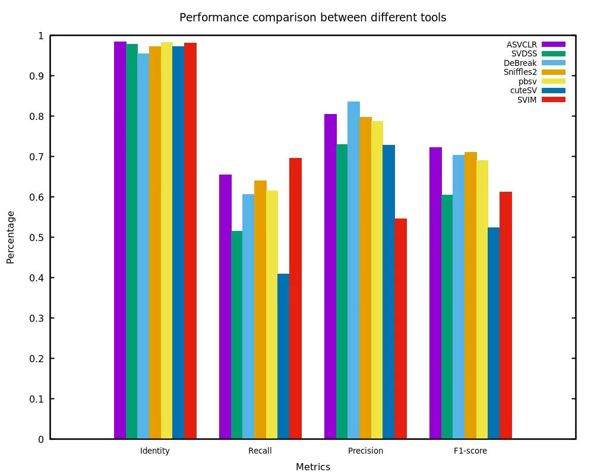

# SV_STAT experiment
In our experiments, we used the high accuracy of the PacBio sequencing platform in CCS mode, combined with NGMLR's alignment capability for long-read data and 30X the coverage depth. This approach provides a well-balanced strategy for detecting variants. The identification results of HG002 CCS data were evaluated using ASVCLR(v1.4.0), cuteSV (v2.0.3), pbsv (v2.9.0), Sniffles (v2.0.2) and SVIM(v2.0.0), respectively. The benchmark dataset was the high-confidence HG002 dataset created by the Genome in a Bottle Consortium (GIAB). More specific experimental information was shown as follows.
## Prerequisites

### Tools

We used  [SV_STAT](https://github.com/zhuxiao/sv_stat) to evaluate variant calling results.

```sh
$ wget -c https://github.com/zhuxiao/sv_stat/releases/download/0.8.0/sv_stat_0.9.0.tar.xz
$ tar -xf sv_stat_0.9.0.tar.xz
$ cd sv_stat_0.9.0/
$ ./autogen.sh
```

And the binary file `sv_stat` will be output into the folder `bin` in this package directory.

We used the following detection methods to variant calling. In addition to the variation detection method included in this experiment, we also introduced a new variation detection tool ASVCLR and evaluated its variation identification results.

```sh
# Get ASVCLR 
$ wget -c https://github.com/zhuxiao/asvclr/releases/download/1.3.0/asvclr_1.3.0.tar.xz
$ tar -xf asvclr_1.3.0.tar.xz
$ cd asvclr_1.3.0/
$ ./auto_gen.sh
# Or get from github
$ git clone https://github.com/zhuxiao/asvclr.git
$ tar -xf asvclr_1.3.0.tar.xz
$ cd asvclr_1.3.0/
$ ./auto_gen.sh
```

And the binary file `asvclr` will be output into the folder `bin` in this package directory.

```sh
# Get cuteSV pbsv sniffles svim and samtools
$ conda install cuteSV=2.0.3 pbsv=2.9.0 sniffles=2.2 svim=2.0.0 samtools  
# We need ngmlr v0.2.7 to align fasta or fastq with reference
$ wget https://github.com/philres/ngmlr/releases/download/v0.2.7/ngmlr-0.2.7-linux-x86_64.tar.gz
$ tar xvzf ngmlr-0.2.7-linux-x86_64.tar.gz
$ cd ngmlr-0.2.7/
$ mkdir build ; cd build
$ cmake ..
$ make
# We also need sratoolkit to download PacBio CCS data.
# centOS
$ wget -c https://ftp-trace.ncbi.nlm.nih.gov/sra/sdk/3.0.10/sratoolkit.3.0.10-centos_linux64.tar.gz
$ tar -zxvf sratoolkit.3.0.10-centos_linux64.tar.gz
$ cd sratoolkit.3.0.10-centos/bin/
# ubuntu
$ wget -c https://ftp-trace.ncbi.nlm.nih.gov/sra/sdk/3.0.10/sratoolkit.3.0.10-ubuntu64.tar.gz
$ tar -zxvf sratoolkit.3.0.10-ubuntu64.tar.gz
$ cd sratoolkit.3.0.10-ubuntu64
```

And the binary file `prefetch`、 `fastq-dump`  and `fasterq-dump` will be output into the folder `bin` in this package directory.

### Data

In our experimental evaluation we used hg19.

#### Download reference

```sh
# Reference
$ wget ftp://ftp-trace.ncbi.nih.gov/1000genomes/ftp/technical/reference/phase2_reference_assembly_sequence/hs37d5.fa.gz
$ gunzip hs37d5.fa.gz
# Extract chromosomes from 1 to 22 and X and Y
$ samtools faidx hs37d5.fa 1 2 3 4 5 6 7 8 9 10 11 12 13 14 15 16 17 18 19 20 21 22 X Y > hs37d5.chroms.fa
```

## HG002

Download [HG002 PacBio CCS](https://www.ncbi.nlm.nih.gov/sra/SRX5327410) data.  After aligning with ngmlr, convert them into bam files using samtools, sort and create index. For convenience, we provide a shell script and a list of accession to help you obtain the fastq file (see `doc` folder). Significantly, you need to ensure that the file and the script are in the same folder.

```sh
$ ./prefetch_fastq.sh
$ ngmlr -t 12 --rg-id na24385_pb_ccs -r hs37d5.chroms.fa -q SRR885_whole.fastq -o HG002_pacbio_ccs.sam
$ samtools view -bSh -@ 12 HG002_pacbio_ccs.sam > HG002_pacbio_ccs.bam
$ samtools sort -@ 12 -o HG002_pacbio_ccs_sorted.bam HG002_pacbio_ccs.bam
$ samtools index -@ 12 HG002_pacbio_ccs_sorted.bam HG002_pacbio_ccs_sorted.bai
# remove fastq to save storage space
$ rm -rf HG002_pacbio_ccs.sam HG002_pacbio_ccs.bam
```

## Variant calling

```sh
# ASVCLR
$ asvclr all -t 12 -m 20 hs37d5.chroms.fa HG002_pacbio_ccs_sorted.bam -o output_asvclr
```

More  detailed usage of ASVCLR can be obtained from Github ([ASVCLR](https://github.com/zhuxiao/asvclr)).

You can get variant detection results in folder `4_results` and variant detection results are reported in VCF file format in this file folder: `genome_variants.vcf`.

```sh
# cuteSV
$ cuteSV -t 12 -l 20 --genotype HG002_pacbio_ccs_sorted.bam hs37d5.chroms.fa output_cuteSV.vcf $PWD
# pbsv
$ pbsv discover -s HG002_30X_CCS HG002_pacbio_ccs_sorted.bam ref.out.svsig.gz
$ pbsv call -m 20 --ccs hs37d5.chroms.fa ref.out.svsig.gz output_pbsv.vcf
# Sniffles
$ sniffles --minsvlen 20 -i HG002_pacbio_ccs_sorted.bam -v output_Sniffles.vcf
# svim
$ svim alignment --min_sv_size 20 --sample HG002_CCS_30X HG002_pacbio_ccs_sorted.bam hs37d5.chroms.fa
```

You can get the following four results:

* **ASVCLR** : `genome_variants.vcf`
* **cuteSV** : `output_cuteSV.vcf`
* **pbsv** : `output_pbsv.vcf`
* **Sniffles** : `output_sniffles.vcf`
* **SVIM** : `variants.vcf`

## GIAB analysis

In this experiment, we used HG002_SVs_Tier1_v0.6.vcf as the gold benchmark set required for the evaluation of user-called sets, which can be downloaded as follows:

```sh
# Get GIAB VCF Tier 1 
$ wget https://ftp-trace.ncbi.nlm.nih.gov/giab/ftp/data/AshkenazimTrio/analysis/NIST_SVs_Integration_v0.6/HG002_SVs_Tier1_v0.6.vcf.gz
$ gunzip HG002_SVs_Tier1_v0.6.vcf.gz

# Run sv_stat against the Tier1 callset and SV_STAT can evaluate multiple user-called sets simultaneously.
$ sv_stat -m 50000 -T "ASVCLR;cuteSV;pbsv;Sniffles;SVIM" -C "1;2;3;4;5;6;7;8;9;10;11;12;13;14;15;16;17;18;19;20;21;22;X;Y" genome_variants.vcf output_cuteSV.vcf output_pbsv.vcf output_sniffles.vcf variants.vcf hs37d5.chroms.fa -o Tier1_eval
```

We used -T option to specify the name of the detection method and -C option to specify the set of chromosomes to be evaluated.  In this experiment, we evaluated the autosomes and sex chromosomes X/Y in the variation Identification results of different detection methods.

## Evaluation results

### Performance evaluation

Typically, evaluation results are saved within the `Tier1_eval` directory, with each tool's results saved in the subfolder named after the respective tool.  Additionally, a local HTML file (`sv_stat_reports.html`) is generated to store the evaluation results for each user-called set.

The evaluation results are shown in the table:

|   Tool   |  SVs   | TP_benchmark | TP_user |  FP   |  FN   |  recall  | precision | F1  score |
| :------: | :----: | :----------: | :-----: | :---: | :---: | :------: | :-------: | :-------: |
|  ASVCLR  | 52857  |    45694     |  44180  | 8677  | 28318 | 0.617386 | 0.835840  | 0.710194  |
|  cuteSV  | 44937  |    39442     |  36955  | 6413  | 34570 | 0.532914 | 0.852126  | 0.655735  |
|   pbsv   | 52807  |    44494     |  42927  | 9253  | 29518 | 0.601173 | 0.822672  | 0.694694  |
| Sniffles | 54545  |    44983     |  43114  | 10160 | 29029 | 0.607780 | 0.809288  | 0.694207  |
|   SVIM   | 116615 |    48028     |  47230  | 30995 | 25984 | 0.648922 | 0.603771  | 0.625533  |

The figure below displays the evaluation results of different detection methods, including two categories of basic metrics.  Detailed statistics can be found in the corresponding text files within the respective folders.

<div style="text-align: center;">
    
    
</div>


### Statistical results of deviation of overlapping variation

Moreover, for regions with overlapping variations, the quantities of  region size ratio and center distance were statistically analyzed to  provide a more intuitive presentation of evaluation information. The statistical results are as follows:

(1) Deviation statistics of center distance

The statistical results of the deviation of center distance are as follows：

|   Tool   | -200~-151 | -150~-101 | -100~-51 | -50~-1 | 0~50  | 51~100 | 101~150 | 151~200 |
| :------: | :-------: | :-------: | :------: | :----: | :---: | :----: | :-----: | :-----: |
|  ASVCLR  |    248    |    402    |   725    |  5682  | 29455 |  4281  |  2144   |  1468   |
|  cuteSV  |    203    |    345    |   696    |  5255  | 25892 |  3471  |  1689   |  1178   |
|   pbsv   |    358    |    501    |   795    |  5123  | 31030 |  2546  |  1756   |  1382   |
| Sniffles |    355    |    469    |   781    |  3732  | 31630 |  4556  |  2043   |  1462   |
|   SVIM   |    602    |    809    |   1283   |  6325  | 33782 |  4056  |  2535   |  2007   |

(2) Deviation statistics of the region size ratio

The statistical results of the deviation of the region size ratio are as follows：

|   Tool   | 0.0~0.5 | 0.5~0.7 | 0.7~1.2 | 1.2~2.0 | 2.0~5.0 | 5.0~10.0 | 10.0~50.0 | 50.0~100.0 | >100.0 |
| :------: | :-----: | :-----: | :-----: | :-----: | :-----: | :------: | :-------: | :--------: | :----: |
|  ASVCLR  |  4373   |   398   |  41354  |   612   |   584   |    168    |    857    |    460     |  3178  |
|  cuteSV  |  3883   |   290   |  37294  |   500   |   417   |    81    |    553    |    255     |  1738  |
|   pbsv   |  4499   |   458   |  36190  |   721   |   715   |   175    |   4452    |    1329    |  3498  |
| Sniffles |  5184   |   442   |  43846  |   604   |   509   |   133    |    633    |    254     |  1701  |
|   SVIM   |  8441   |   574   |  46891  |   691   |   750   |   265    |   1261    |    704     |  4842  |


### Evaluation results for metrics of different SV size regions

Additionally, basic metrics for different structural variant (SV) size ranges were computed, primarily categorized into the following seven intervals. The results are showed as follow:

(1) Evaluation results for metrics of different SV size regions with different methods

Variations are categorized into seven size regions and metrics are computed for comprehensive evaluation for different detection methods within each region. The evaluation results are as followed:

<div style="text-align: center;">
    
</div>


(2) Statistics of the count of different SV lengths in the user-called set (ASVCLR):

|    region    | TP_bench | TP_user |  FP  |  FN   |  recall  | precision | F1 score |
| :----------: | :------: | :-----: | :--: | :---: | :------: | :-------: | :------: |
|   1-100bp    |  38240   |  36972  | 7288 | 25904 | 0.596159 | 0.835337  | 0.695766 |
|  101-250bp   |   2032   |  1870   | 972  | 1926  | 0.513391 | 0.657987  | 0.576764 |
|  251-500bp   |   1701   |  1662   | 1504 | 1271  | 0.572342 | 0.524953  | 0.547624 |
|  501-1000bp  |   364    |   358   | 870  |  748  | 0.327338 | 0.291531  | 0.308399 |
| 1001-5000bp  |   577    |   578   | 439  |  661  | 0.466074 | 0.568338  | 0.512151 |
| 5001-10000bp |   138    |   138   |  116  |  198  | 0.410714 | 0.543307  | 0.467797 |
|   >10001bp   |    44    |   44    |  46  |  208  | 0.174603 | 0.488889  | 0.257310 |

The evaluation results of ASVCLR in different SV size regions show as follow with figures:

<div style="text-align: center;">
    
    
</div>


(3) Statistics of the count of different SV lengths in the user-called set (cuteSV):

|    region    | TP_bench | TP_user |  FP  |  FN   |  recall  | precision | F1 score |
| :----------: | :------: | :-----: | :--: | :---: | :------: | :-------: | :------: |
|   1-100bp    |  33438   |  31461  | 5502 | 30706 | 0.521296 | 0.851148  | 0.646584 |
|  101-250bp   |   1865   |  1683   | 549  | 2093  | 0.471198 | 0.754032  | 0.579970 |
|  251-500bp   |   1618   |  1576   | 892  | 1354  | 0.544415 | 0.638574  | 0.587747 |
|  501-1000bp  |   349    |   341   | 472  |  763  | 0.313849 | 0.419434  | 0.359040 |
| 1001-5000bp  |   522    |   511   | 167  |  716  | 0.421648 | 0.753687  | 0.540766 |
| 5001-10000bp |   113    |   113   |  18  |  223  | 0.336310 | 0.862595  | 0.483940 |
|   >10001bp   |    39    |   40    |  43  |  213  | 0.154762 | 0.481925  | 0.235287 |

The evaluation results of cuteSV in different SV size regions show as follow with figures:

<div style="text-align: center;">
    
    
</div>


(3) Statistics of the count of different SV lengths in the user-called set (pbsv):

|    region    | TP_bench | TP_user |  FP  |  FN   |  recall  | precision | F1 score |
| :----------: | :------: | :-----: | :--: | :---: | :------: | :-------: | :------: |
|   1-100bp    |  37343   |  35360  | 7614 | 26801 | 0.582174 | 0.822823  | 0.681890 |
|  101-250bp   |   1970   |  1792   | 1855 | 1988  | 0.497726 | 0.491363  | 0.494524 |
|  251-500bp   |   1656   |  1618   | 1609 | 1316  | 0.557201 | 0.501395  | 0.527827 |
|  501-1000bp  |   355    |   351   | 738  |  757  | 0.319245 | 0.322314  | 0.320772 |
| 1001-5000bp  |   591    |   582   | 288  |  647  | 0.477383 | 0.668966  | 0.557165 |
| 5001-10000bp |   139    |   140   |  67  |  197  | 0.413690 | 0.676328  | 0.513368 |
|   >10001bp   |    57    |   59    | 107  |  195  | 0.226190 | 0.355422  | 0.276449 |

The evaluation results of pbsv in different SV size regions show as follow with figures:

<div style="text-align: center;">
    
    
</div>


(4) Statistics of the count of different SV lengths in the user-called set (Sniffles):

|    region    | TP_bench | TP_user |  FP  |  FN   |  recall  | precision | F1 score |
| :----------: | :------: | :-----: | :--: | :---: | :------: | :-------: | :------: |
|   1-100bp    |  38459   |  36520  | 9296 | 25685 | 0.599573 | 0.797101  | 0.684369 |
|  101-250bp   |   2096   |  1926   | 592  | 1862  | 0.529560 | 0.764893  | 0.625835 |
|  251-500bp   |   1737   |  1699   | 1072 | 1235  | 0.584455 | 0.613136  | 0.598452 |
|  501-1000bp  |   416    |   413   | 524  |  696  | 0.374101 | 0.440768  | 0.404707 |
| 1001-5000bp  |   615    |   616   | 258  |  623  | 0.496769 | 0.704805  | 0.582778 |
| 5001-10000bp |   142    |   144   |  66  |  194  | 0.422619 | 0.685714  | 0.522940 |
|   >10001bp   |    52    |   55    |  93  |  200  | 0.206349 | 0.371622  | 0.265355 |

The evaluation results of Sniffles in different SV size regions show as follow with figures:

<div style="text-align: center;">
    
    
</div>


(4) Statistics of the count of different SV lengths in the user-called set (SVIM):

|    region    | TP_bench | TP_user |  FP   |  FN   |  recall  | precision | F1 score |
| :----------: | :------: | :-----: | :---: | :---: | :------: | :-------: | :------: |
|   1-100bp    |  41223   |  39159  | 26170 | 22921 | 0.642663 | 0.599412  | 0.620285 |
|  101-250bp   |   2138   |  1954   | 2506  | 1820  | 0.540172 | 0.438117  | 0.483821 |
|  251-500bp   |   1776   |  1742   | 2507  | 1196  | 0.597577 | 0.409979  | 0.486313 |
|  501-1000bp  |   442    |   438   | 1312  |  670  | 0.397482 | 0.250286  | 0.307160 |
| 1001-5000bp  |   645    |   652   |  957  |  593  | 0.521002 | 0.405221  | 0.455875 |
| 5001-10000bp |   143    |   146   |  218  |  193  | 0.425595 | 0.401099  | 0.412984 |
|   >10001bp   |    62    |   71    |  393  |  190  | 0.246032 | 0.153017  | 0.188684 |

The evaluation results of SVIM in different SV size regions show as follow with figures:

<div style="text-align: center;">
    
    
</div>

### Quantitative distribution statistics of variation

Additionally, the distribution of the number of variations in the reference set and  user-called set was statistically analyzed, as shown below:

(1) Statistics of the count of different SV lengths in the benchmark set:
The SV reference region size statistics for benchmark set: Total SVs number：74012
<div align="center">
 
</div>

(2) Statistics of the count of different SV lengths in the user-called set (ASVCLR):

The SV reference region size statistics before filtering for user-called set (ASVCLR): Total SVs number：50674
The SV reference region size statistics after filtering for user-called set (ASVCLR): Total SVs number：50674                                                                                          
The result statistics before filtering are shown in the left figure, and the result statistics after filtering are shown in the right figure:

<div style="text-align: center;">
    
    
</div>                                                                                                            


(3) Statistics of the count of different SV lengths in the user-called set (cuteSV):

The SV reference region size statistics before filtering for user-called set (cuteSV): Total SVs number：44937
The SV reference region size statistics after filtering for user-called set (cuteSV): Total SVs number：44928
The result statistics before filtering are shown in the left figure, and the result statistics after filtering are shown in the right figure:

<div style="text-align: center;">
    
    
</div>


(4) Statistics of the count of different SV lengths in the user-called set (pbsv):

The SV reference region size statistics before filtering for user-called set (pbsv): Total SVs number：52807
The SV reference region size statistics after filtering for user-called set (pbsv): Total SVs number：52741
The result statistics before filtering are shown in the left figure, and the result statistics after filtering are shown in the right figure:

<div style="text-align: center;">
   
    
    
 
</div>


(5) Statistics of the count of different SV lengths in the user-called set (Sniffles):

The SV reference region size statistics before filtering for user-called set (Sniffles): Total SVs number：54545
The SV reference region size statistics after filtering for user-called set (Sniffles): Total SVs number：54458
The result statistics before filtering are shown in the left figure, and the result statistics after filtering are shown in the right figure:

<div style="text-align: center;">
    
    
</div>


(6) Statistics of the count of different SV lengths in the user-called set (SVIM):

The SV reference region size statistics before filtering for user-called set (SVIM): Total SVs number：116615
The SV reference region size statistics after filtering for user-called set (SVIM): Total SVs number：116427
The result statistics before filtering are shown in the left figure, and the result statistics after filtering are shown in the right figure:

<div style="text-align: center;">
    
    
</div>

 More detailed result information can be found in the `evaluation_report.html` after completing the assessment following the above steps.

## Contact

If you have problems or some suggestions, please contact: zhuxiao_hit@yeah.net without hesitation. 

---- Enjoy !!! -----
